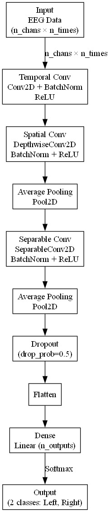
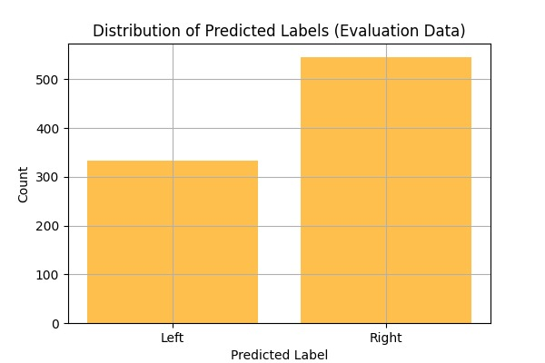
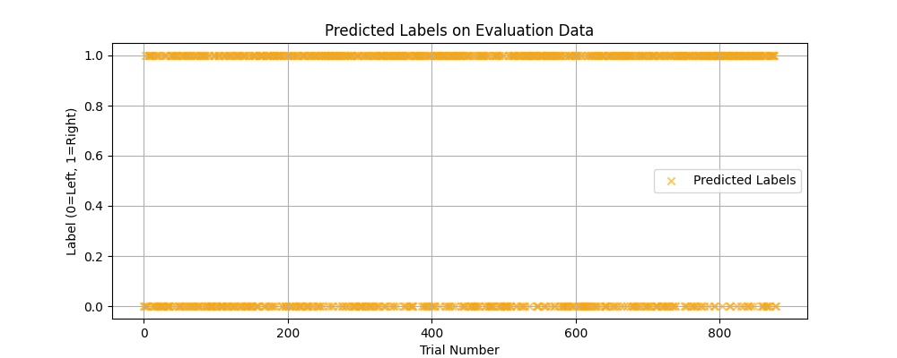
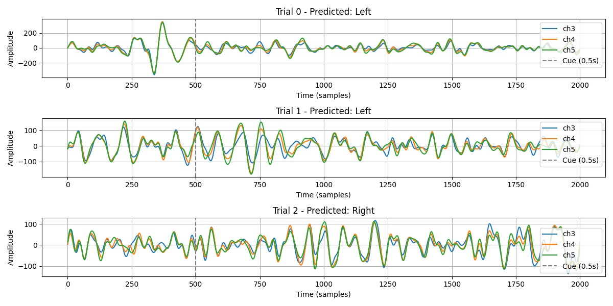
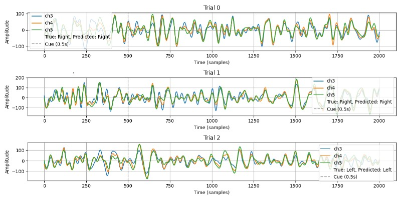

# EEG-Based Motor Imagery Classification

This project involves using deep learning techniques to classify motor imagery EEG signals (left vs. right hand movement imagery) using a convolutional neural network (CNN). The model predicts motor intent from EEG data and is evaluated on a test dataset.

---

## 🧠 Project Overview

Electroencephalography (EEG) signals are used to interpret motor intentions in brain-computer interface (BCI) applications. This project aims to:

- Preprocess EEG data  
- Train a deep CNN model  
- Classify motor imagery (left vs. right)  
- Visualize model predictions and performance  

---

## 🗃️ Dataset

- Input shape: `(n_channels, n_times)` per trial  
- Channels used: `ch3`, `ch4`, `ch5`  
- Labels:  
  - `0` = Left imagery  
  - `1` = Right imagery  
- Data is structured into trials with temporal sequences  

---

## 🧠 Model Architecture

The deep learning architecture consists of temporal and spatial convolutional layers followed by pooling, dropout, and a dense classification layer.

  

---

## 📊 Results & Visualizations

### Label Distribution

Distribution of predicted labels on the evaluation dataset:

  

---

### Predicted Labels Across All Trials

Visualizing all predicted labels against trial numbers:

  

---

### Sample Trial Predictions (Correct)

EEG waveforms for a few trials where predictions match the true labels:

  

---

### Sample Trial Predictions (Incorrect)

EEG waveforms for a few trials where predictions are incorrect:

  

---

## 📂 Files

- `EEG.ipynb`: Jupyter notebook with data processing, model training, evaluation, and visualization  
- `images/`: Contains all the result and architecture images

---

## 🚀 How to Run

1. Clone this repository  
2. Open `EEG.ipynb` in Jupyter Notebook or Google Colab  
3. Run all cells to:
   - Preprocess EEG data  
   - Train the CNN  
   - Evaluate predictions  

---

## 🧪 Future Work

- Add more EEG channels or frequency-domain features  
- Explore transformer or attention-based models  
- Integrate for real-time BCI feedback  

---

## 📬 Contact

For feedback or questions, please open an issue on this repository.

---
